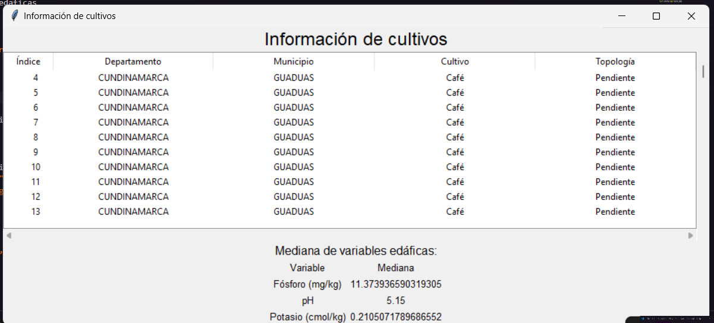

#Analisis de Suelos

## Descripción
Este proyecto tiene como objetivo el análisis de suelos, para ello se utilizará un dataset que contiene información sobre diferentes tipos de suelos y sus características. El dataset obtenido de [Resultados de Análisis de Laboratorio Suelos en Colombia](https://www.datos.gov.co/Agricultura-y-Desarrollo-Rural/Resultados-de-An-lisis-de-Laboratorio-Suelos-en-Co/ch4u-f3i5/about_data)


## Objetivos
- Realizar un análisis exploratorio de los datos
- Realizar un limpieza  de los datos para ph, fosforo y potasio
- Hallar la mediana de los datos

## Integrantes
>Jeronimo Riveros

##Conexcion con la API de Socrata de Datos Abiertos de Colombia
Para la conexión con la API de Socrata de Datos Abiertos de Colombia se utilizó la librería sodapy, la cual permite la conexión con la API y la descarga de los datos. Para ello se utilizó el siguiente código:

```python
import pandas as pd
from sodapy import Socrata   

def get_data(departamento=None, municipio=None, cultivo=None, limit=None): 
  #permite Consultar por parametros

  client = Socrata('www.datos.gov.co',None)

  params = {}
  if departamento:
    params["departamento"] = departamento
  if municipio:
    params["municipio"] = municipio
  if cultivo:
    params["cultivo"] = cultivo

  print(params)
  results = client.get("ch4u-f3i5", limit=limit, **params)

  # Convertir resultados a DataFrame
  results_df = pd.DataFrame.from_records(results)
  return results_df

```
se utilizo ademas PANDAS para la manipulación de los datos y la libreria sodapy para la conexión con la API de Socrata de Datos Abiertos de Colombia

## Limpieza de Datos
para homogenizar los datos y lograr dejarlos en un formato adecuado para el análisis de la mediana se tuvo en cuenta caracteres especiales como "<", las ",", entre otros que obstaculizaban el correcto funcionamiento de la funcioncion de mediana, para ello se utilizo el siguiente código:

```python
def eliminar_caracteres_especiales(data):
    try:
        data['potasio_k_intercambiable_cmol_kg'] = data['potasio_k_intercambiable_cmol_kg'].str.replace('[<>]', '', regex=True)
        data['f_sforo_p_bray_ii_mg_kg'] = data['f_sforo_p_bray_ii_mg_kg'].str.replace('[<>]', '', regex=True)
        data['ph_agua_suelo_2_5_1_0'] = data['ph_agua_suelo_2_5_1_0'].str.replace('[<>]', '', regex=True)
        return data
    except Exception as e:
        print(f"Error al eliminar caracteres especiales: {str(e)}")
        return None
    
def cambiar_coma_por_punto(data):
    try:
        data['potasio_k_intercambiable_cmol_kg'] = data['potasio_k_intercambiable_cmol_kg'].str.replace(',', '.', regex=True)
        data['f_sforo_p_bray_ii_mg_kg'] = data['f_sforo_p_bray_ii_mg_kg'].str.replace(',', '.', regex=True)
        data['ph_agua_suelo_2_5_1_0'] = data['ph_agua_suelo_2_5_1_0'].str.replace(',', '.', regex=True)
        return data
    except Exception as e:
        print(f"Error al cambiar la coma por punto: {str(e)}")
        return None
```

## Interfaz Grafica
Por ultimo el usuario podra ver los datos solicitados por el en una interfaz
(se anexa imagen de la interfaz donde se filtro por departamento y cultivo)


